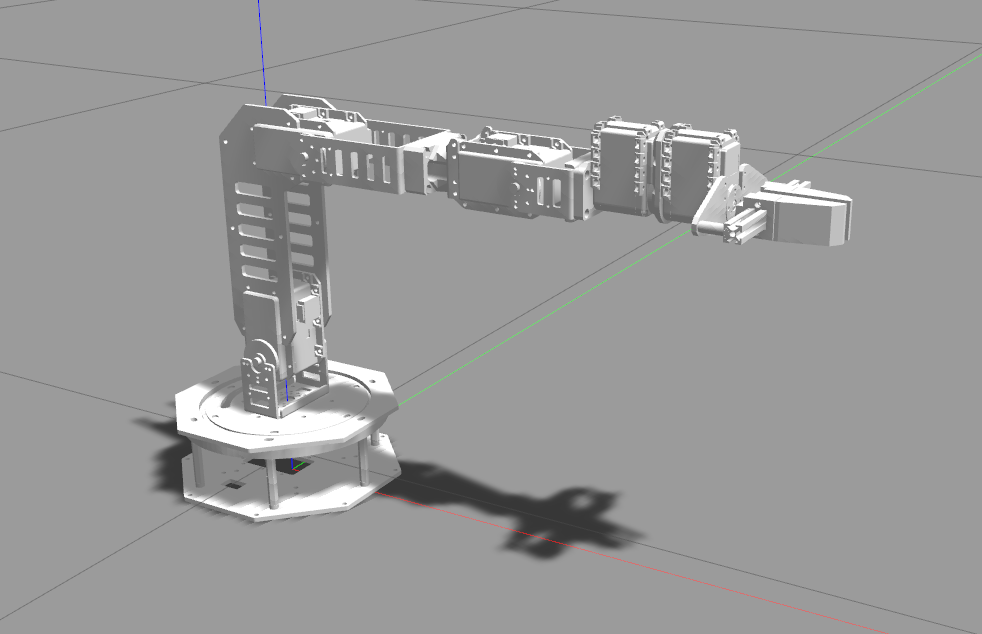
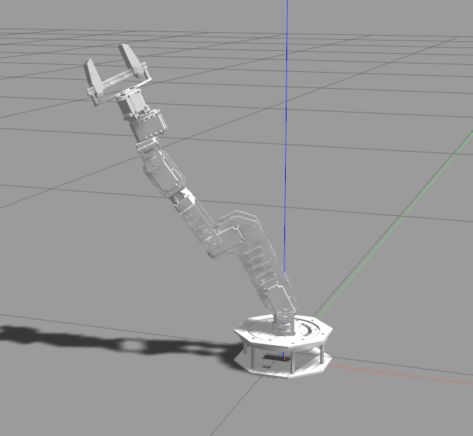

# Widowxl Gazebo
 

## Installation and configuration

* First clone the repo into your ws
* Catkin_make
* source ./devel/setup.bash
* `roslaunch arm gazebo.launch`
* Unpause the the world of gazebo
* Open a new terminal and hit `roslaunch move_arm widowxl_arm_planning_execution.launch`
* Enjoy :)

### Also see [widowx_arm](https://github.com/RobotnikAutomation/widowx_arm) ↩️
